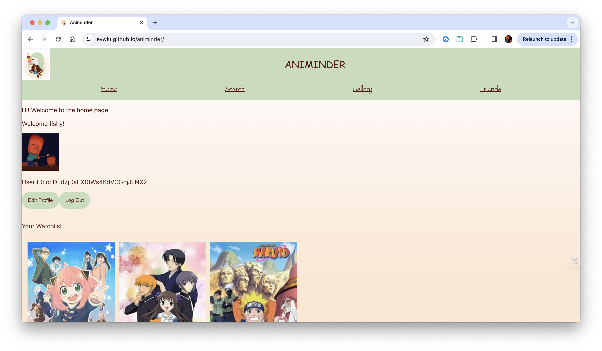

# Animinder

## Table of Contents

- [About](#about)
- [Technologies Used](#technologies-used)
- [Project Overview](#project-overview)
- [Project Structure](#project-structure)
- [Getting Started](#getting-started)

## About

Animinder is a social web app that allows users to create a personal anime watchlist and view the watchlists of their friends! In addition to the watchlist, Animinder recommends you popular shows based on both your and your friends' preferences. Click [here](https://evwlu.github.io/animinder/) for a demo!

## Technologies Used

Notably dependencies and frameworks.

[React.js](https://reactjs.org/)
| [Firestore Database](https://firebase.google.com/)
| [Firebase Authentication](https://firebase.google.com/docs/auth)
| [Jikan API](https://jikan.moe/)

## Project Overview

Associated functionalities with pages are linked in the directory `client/src`.
`assets` denote relevant assets used for the page; `components` denote page
components such as the NavBar that are used in the pages; `firebase` denotes
server and API-related configuration settings; `interfaces` denotes JSON
definitions for anime titles and users; `pages` denote all visitable pages
via the NavBar (and the login page); and `styles` denote CSS files used for 
associated components and pages.

## Getting Started

1) To get started, clone the repository to your own desktop.

> `git clone https://github.com/evwlu/animinder.git`

2) Run `npm install` in the `client` directory.

3) Create a Firebase project, authenticate `localhost` or your domain of choice,
and create a `.env` file in the `client` directory. Fill out the following
fields in the `.env` file:

> REACT_APP_FIREBASE_CONFIG_AUTHDOMAIN = "..."
REACT_APP_FIREBASE_CONFIG_PROJECTID = "..."
REACT_APP_FIREBASE_CONFIG_STORAGEBUCKET = "..."
REACT_APP_FIREBASE_CONFIG_MESSAGINGSENDERID = "..."
REACT_APP_FIREBASE_CONFIG_APPID = "..."

4) Run `npm start` in the `client directory`. 

